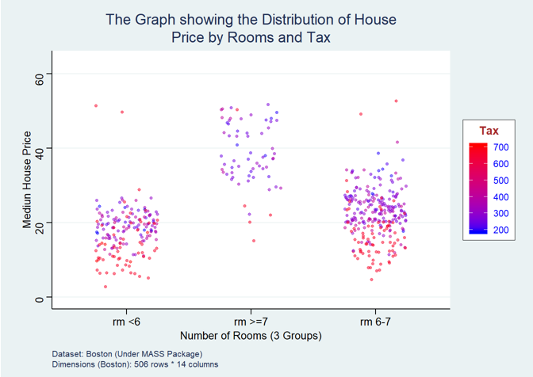

I am planning to cover different aspects of Data science which includes Data management, Data visualization and Statistical analysis using R in subsequent courses. My primary motivation is to share maximum knowledge to whoever in need. I believe the courses will be good enough to shape early career researchers and job seekers in the field of Data Science and health care analytics. Happy Learning.

---

## Offspring 2019-R Course

I am very pleased to inform that the course become quite popular in its first stage. Nearabout 270 participants register for the course mostly from Biostatistics/ Statistics/Demography/Social Science background from International Institute for Population Sciences (IIPS) and Banaras Hindu University (BHU). 

The important part of the course that it's completely free of cost and the vast data management and statistics domains have been covered by using some interactive examples. I am sharing here all the materials related to the R course **Offspring 2019** which are as follows:

So, first thing first, the syllabus and instructions of the course is available in https://appwick-hub.github.io/Offspring-2019/Course_Instruction_Syllabus.nb.html \ref [https://appwick-hub.github.io/Offspring-2019/Course_Instruction_Syllabus.nb.html]

**1st Week: ** In the 1st week of the course we learnt basically to install R and R studio and performed some basic operations in R. The reference web page you can find at https://appwick-hub.github.io/Offspring-2019/Offspring-2019-0.nb.html \ref [https://appwick-hub.github.io/Offspring-2019/Offspring-2019-0.nb.html]

**2nd Week: ** In the 2nd week, we discussed mainly about sampling and random number generation. The reference web page you can find at https://appwick-hub.github.io/Offspring-2019/Offspring-2019-1.nb.html \ref [https://appwick-hub.github.io/Offspring-2019/Offspring-2019-1.nb.html]


**3rd Week: ** In the 3rd week we discussed on writing conditions, loops and functions. The reference web page you can find at https://appwick-hub.github.io/Offspring-2019/Offspring-2019-2.nb.html \ref [https://appwick-hub.github.io/Offspring-2019/Offspring-2019-2.nb.html]

---

$N.B:$ Since I am a doctoral fellow like many of you I may do some mistakes. Please do correct me. If you have anything to say about course contents or any other issues, do write to me at *apurba@post.bgu.ac.il* \ref [apurba@post.bgu.ac.il]. 

I am very positive to organize such courses freely in future through which interested participants can shape themselves technically in the field of Public Health and Data Scienece using R and Python. I believe a huge quality crisis is there in the field of data science and public health in India, so by conducting such free courses, a huge number of candidates can be trained to get proper jobs in such fields.  

---

```{r pressure, echo=FALSE, fig.cap="An interactive visualization using R", out.width = '60%', fig.align="center"}

```
