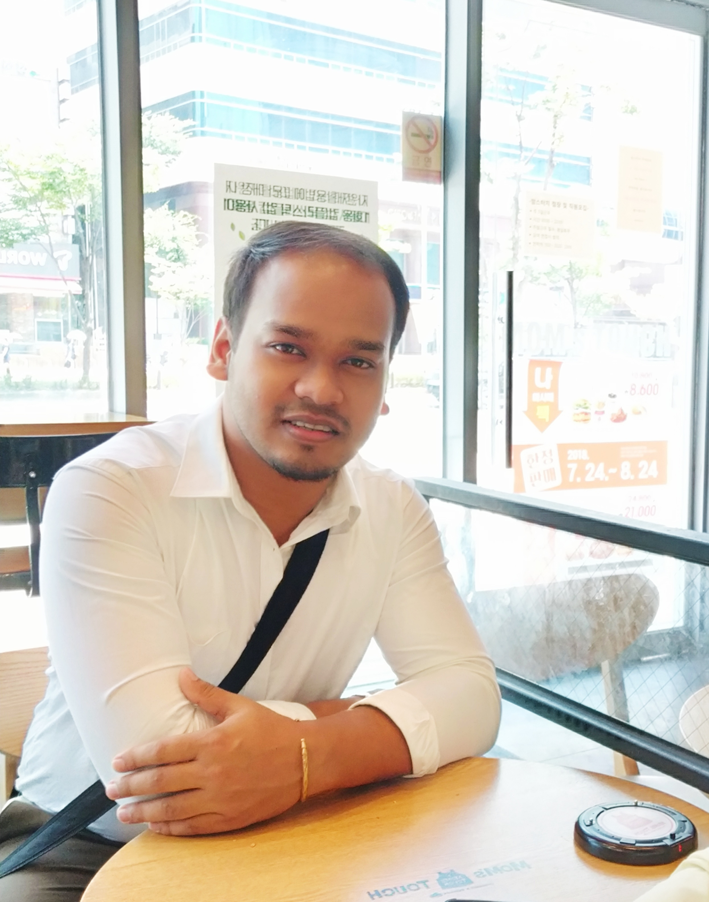

I am an **Indian Citizen from Balurghat, West Bengal**, currently pursuing my Doctoal Studies in Statistics and Epidemiology from the Ben Gurion University of the Negev, Israel. Currently, I am working on Autism by developing some statistical models and machine learning algorithms using R and Python programming language.

# Thats me:

```{r pressure, echo=FALSE, fig.cap="Somewhere in Daejeon, South Korea while attending 5th Kostat Summer Training on R and Stata, 2018", out.width = '60%', fig.align="center"}

```


# Thats the Ben Gurion University: 

```{r, echo=FALSE, fig.cap="View from the University library, 2019", out.width = '70%', fig.align="center"}
knitr::include_graphics("University.jpg")
```

---

# My research interests are as follows:

Predictve Modelling

Survival Analysis

Spatial Analysis

Machine Learning

Genetics of Autism

Non Communicable Diseases

---


```{r, echo=FALSE, fig.cap="Beautiful Busan (view from the Jagalchi Market, 2018)", out.width = '80%', fig.align="center"}
knitr::include_graphics("Busan.jpg")
```
