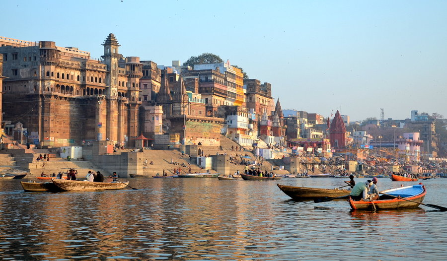

I, Apurba Shil, an Indian Citizen, currently pursuing my Doctoal Studies in Statistics and Epidemiology from the Ben Gurion University of the Negev, Israel. Currently, I am working on the genetics of Autism Spectrum Disorders (ASDs) by developing some machine learning algorithms using R and Python programming language.


```{r pressure, echo=FALSE, fig.cap="While attending the 5th KOSTAT Summer Training on R and Stata, 2018 in Daejeon, South Korea", out.height='40%', out.width = '40%', fig.align="center"}
knitr::include_graphics("IMG_20180727_125347.jpg")
```

---

# Research Interests

Predictve Modelling

Spatial Analysis

Machine Learning

Genetics of Autism

Non Communicable Diseases.

---

# Research Publications

I am sharing here some of my research works with you as follows:

(1) **A geospatial analysis of noncommunicable disease (NCD) burden in Indian agro-climatic and political regions**. You can access this publication at https://link.springer.com/article/10.1007/s10389-017-0876-2 \ref [https://link.springer.com/article/10.1007/s10389-017-0876-2]

(2) **Exploring the spatial heterogeneity in different doses of vaccination coverage in India**. You can access this publication at https://journals.plos.org/plosone/article?id=10.1371/journal.pone.0207209 \ref [https://journals.plos.org/plosone/article?id=10.1371/journal.pone.0207209]

---

# Other Webpages

$LinkedIn:$ https://www.linkedin.com/in/apurba-shil-2645817a/ \ref [https://www.linkedin.com/in/apurba-shil-2645817a/].

$ResearchGate:$ https://www.researchgate.net/profile/Apurba_Shil \ref [https://www.researchgate.net/profile/Apurba_Shil].

$Facebook:$ https://www.facebook.com/apurba.shil.7 \ref [https://www.facebook.com/apurba.shil.7]

---

# Contact Details


Apurba Shil, Doctoral Fellow (Statistics and Epidemiology),

Dept. of Public Health, Faculty of Health Sciences, 

Email Id: apurba@post.bgu.ac.il \ref [apurba@post.bgu.ac.il],

Ben Gurion University, Beersheva, Israel,

Cell No: +91 8291585630 (India)/+972 585426166 (Israel)

---

```{r, echo=FALSE, fig.cap="Varanasi, 2015-16", out.width = '100%',out.height='100%', fig.align="center"}

```

---