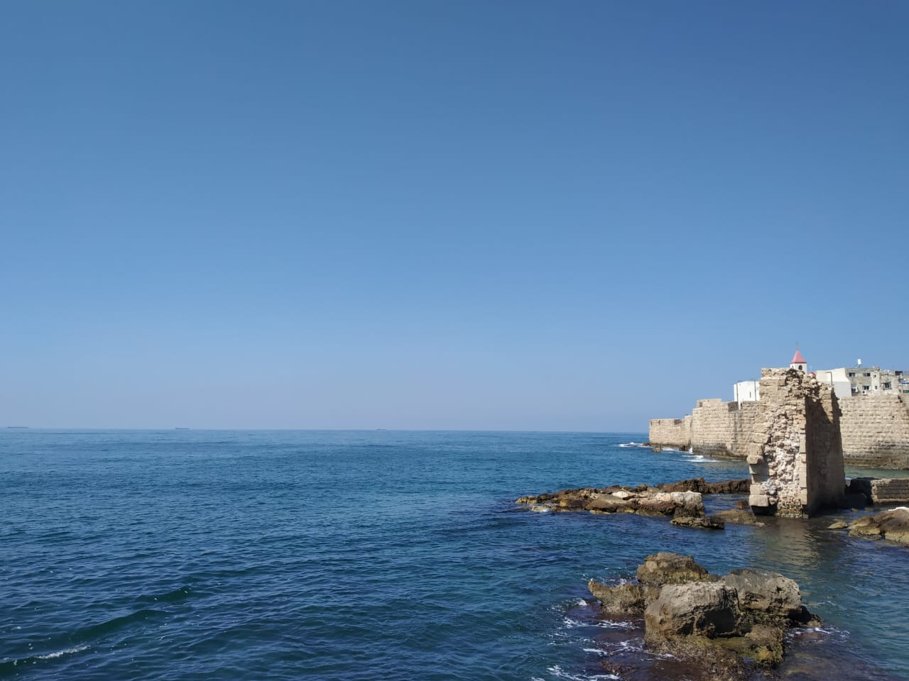
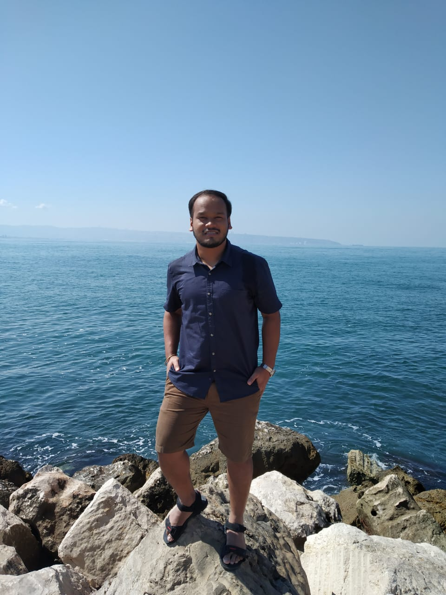
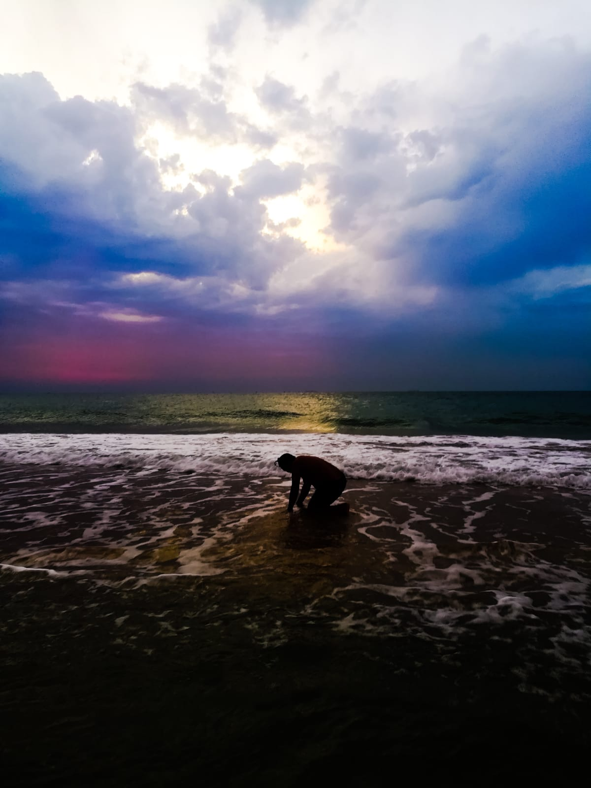
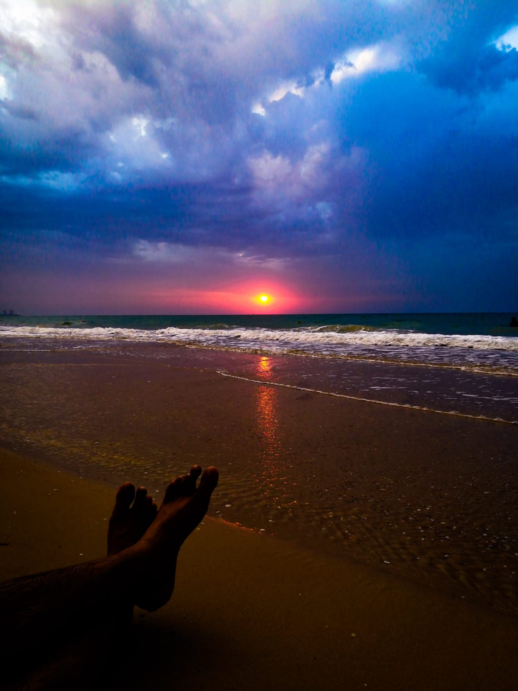
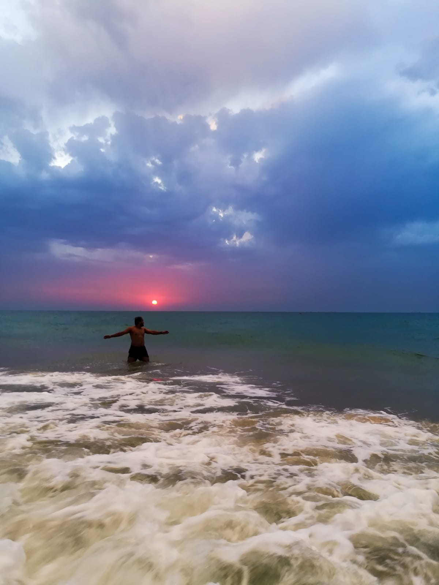
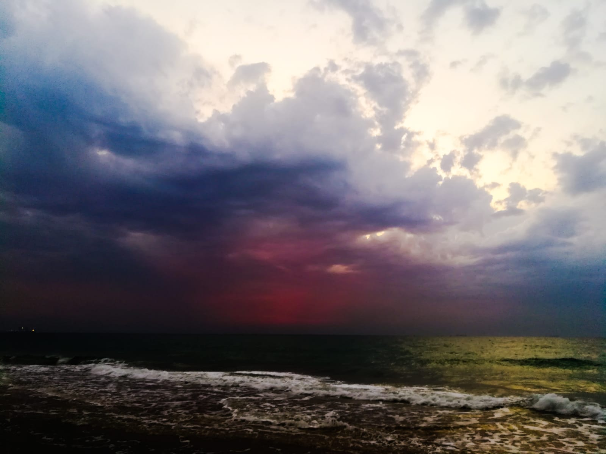
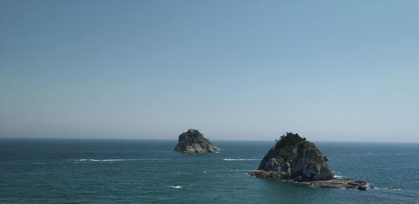
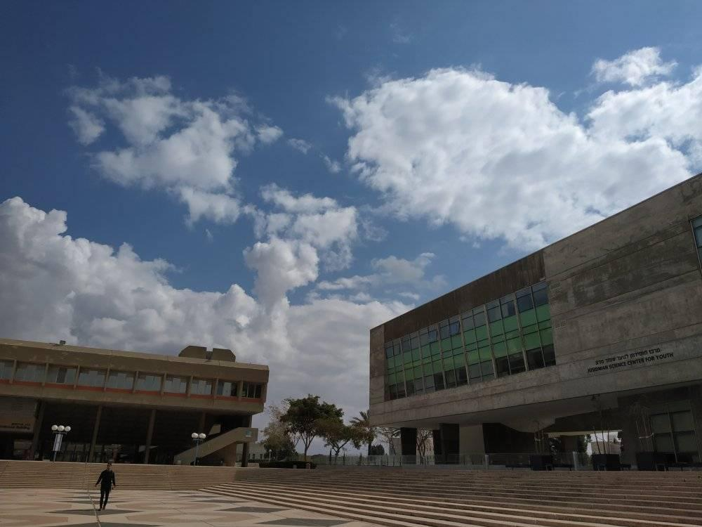
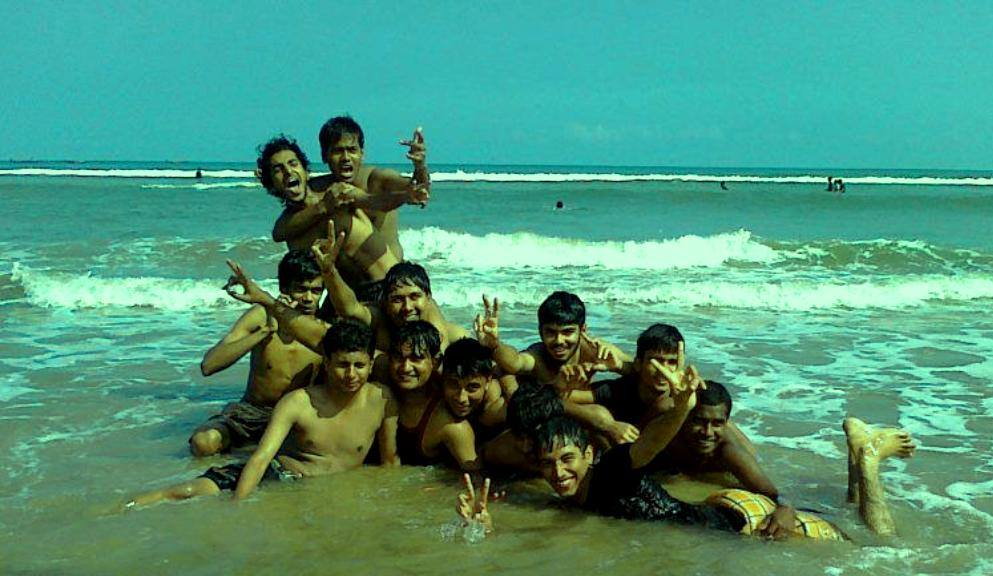

---
output:
  html_document:
    theme: yeti
---

Some of the memories which I am experiencing throughout my life are as follows. 

Someone truly said, **"Travelling means getting to know the real you!!"**. I like to travel a lot and I have a full bucket of list of destinations to cover.

{width=80% height=70%}

{width=80% height=70%}

{width=80% height=70%}

{width=80% height=70%} 

{width=80% height=70%} 

{width=80% height=70%} 

{width=80% height=70%}

{width=80% height=90%}

{width=80% height=70%}

---